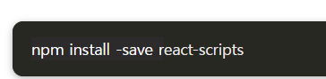

# 본 프로젝트는 오픈소스 프로젝트입니다.

# 클론 후 설정법
```bash
우선 pyenv와 poetry를 설치해 주세요 이후 pyenv로 버전을 3.10.2로 맞추어 주신 후 poetry env use python or python3 or python3.10.2를 설정해 주신 후 poetry shell로 들어간 후 poetry install로 의존성을 맞추어주세요

이후 frontend 디렉터리에서 npm i 명령어로 노드 의존성도 충족해주세요

```


```bash
적용전에는
```